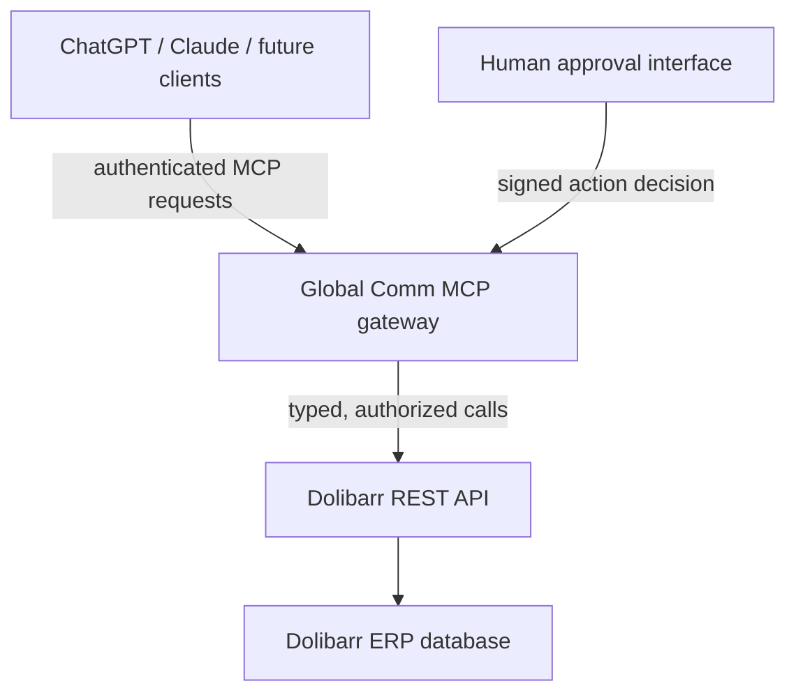

# Global Comm Dolibarr MCP — initial architecture (Phase 0 design)

**Status:** design proposal from upstream audit at `360cb7c66e470a1c844f22320573c2ced2f01c4d`; no implementation, fork or production deployment has occurred. Dolibarr 24.x API paths and permissions are UNVERIFIED on the target instance.

## Scope and trust boundaries



- MCP is the only AI-accessible business interface. It exposes named tools with narrow schemas and curated output.
- Dolibarr remains the system of record. The MCP server uses **one dedicated restricted Dolibarr API user** (`gc_ai` proposed) over HTTPS; no direct SQL, SupAdmin account, arbitrary REST tool, or database credentials.
- Authentication proves the **MCP caller**. Authorization grants that caller access to a specific tool and object. The Dolibarr service account applies a separate least-privilege ceiling. A shared bearer token without caller identity cannot satisfy future per-user approval/accountability needs.
- Human approval is an authenticated server-side decision over a digest of a prepared action (actor, tool, object IDs, amounts, currency, document content, expiry and idempotency key). Text from a model saying “confirmed” is not approval. A changed payload requires new approval.

## Proposed call pipeline

1. Authenticate remote caller; validate origin/host and request limits. For stdio, define a separate local trust and user-identity model before enabling writes.
2. Check tool is uniquely registered and enabled; select only a named, versioned typed operation.
3. Validate bounded input and object IDs; reject extra fields, unsupported currency and ambiguous dates.
4. Authorize actor, module and object scope; classify risk level 0–3 from immutable server metadata.
5. For writes, read and verify current record status and references; build a redacted action preview. For Level 2, stop until the same exact action has human approval; Level 3 is disabled by default. Never use client prose as a bypass.
6. Reserve an idempotency key and emit a durable audit attempt; invoke a verified Dolibarr REST adapter; reconcile uncertain timeouts without blindly replaying non-idempotent calls.
7. Map response to a limited typed DTO; log result/status/duration without credentials or full payloads. Return a meaningful error if the outcome is uncertain.

**Policy record (conceptual, not current code):**

```ts
type Policy = {
  tool: string;
  risk: 0 | 1 | 2 | 3;
  mutation: boolean;
  productionEnabled: boolean;
  requiredScope: string;
  approval: 'none' | 'exact_action';
};
```

The registry must reject duplicates (the audited upstream has three) and tools without metadata. The request dispatcher must recheck policy at execution time, including after an approval is issued. Treat a GET such as `documents/builddoc` as a potential write according to effect, not HTTP verb.

## Capability order

| Risk | Initial capability | Execution rule |
|---|---|---|
| 0 | Search/read third parties, projects, proposals, orders, invoices; carefully scoped bank reads | Authenticated and authorized; redact sensitive data; audit finance/HR reads. |
| 1 | Draft prospect/project/proposal/RFQ/order/invoice, only where Dolibarr draft status is verified | Server validates exact draft state, fields and ownership; audit and idempotency. |
| 2 | Validate/send/close/convert documents, accept quotations | Disabled until server-side exact-action human approval is working and client identity is sound. |
| 3 | Payments, banking, accounting writes, deletion, configuration and payroll | Disabled and absent from production `tools/list` initially. |

An `ALLOW` in the inventory means a **candidate** for the future allowlist, contingent on API, rights and auth verification. It is not permission to call Global Comm production today.

## Business adapter and project model

- Keep native Dolibarr references to projects. Separate customer proposals/orders/invoices and supplier RFQs/quotations/orders/invoices. Do not equate a supplier RFQ with a supplier order.
- `get_project_objects(project_id)` must resolve actual project-linked objects through version-verified endpoints, handle pagination and deduplicate links. Discovery of these associations is pending.
- `get_project_financials` reports separately **quoted**, **ordered**, **invoiced**, and **collected** customer amounts, plus **quoted**, **ordered**, **invoiced**, and **paid** supplier amounts. Every number carries HT/TTC, currency, tax and period provenance. Missing sources are reported as unavailable, never zero by default.
- `get_project_margin` derives named measures, such as invoiced margin HT = customer invoiced HT − supplier invoiced HT, from complete verified inputs. Use decimal arithmetic (or integer minor units where applicable); explicitly state costs omitted, adjustments, credit notes, multi-currency and partial payment treatment.
- `compare_supplier_quotes` only operates on distinct supplier quotation objects linked to the same requirement; it never substitutes a purchase order. Verify an RFQ API in Dolibarr 24.x before adding a write tool.
- Use the Intercocina project `PJ2609-0002` / supplier RFQ `RQ2609-0001` as a **reference scenario only**. No Phase 0 call has queried or changed those records.

## Proposed modules and controlled reuse

```text
src/
  transport/            stdio and remote HTTP adapters
  identity/             authentication and caller context
  registry/             unique typed tools + policy metadata
  policies/             authorization, risk, approval, data exposure
  business/             third parties, projects, sales, purchasing, reporting
  dolibarr/             restricted HTTP client, DTOs and contract mapping
  audit/                action journal, idempotency and reconciliation
  errors/               sanitized typed failures
```

Preserve and harden the upstream Axios client and useful read/draft handler logic instead of rewriting everything. Move security decisions from individual handlers to a central dispatcher. Do not preserve Digital Factory-specific hardcoded IDs, FCFA/SYSCOHADA calculations, static ERP status claims or its deployment credentials/layout.

## Exact fork and implementation path (proposed, not started)

1. **Phase 1 — fork and baseline:** establish organization access; fork or create `Global-C-Corp/Global-Comm-Dolibarr-MCP` with upstream attribution and full license text; `origin` points to GC, `upstream` to source commit; create development branch. Resolve `package-lock.json` vs package manifest, add a stable CI build, unique-name check and test harness; centralize version metadata. Do not copy the upstream auto-deploy workflow to Global Comm.
2. **Phase 2 — security foundation:** validate environment/URL, remote authentication and actor identity; central tool allowlist/authorization, risk policy, immutable approval flow, error redaction, audit and idempotency; disable all Level 3 and most non-core tools; test with mocks.
3. **Phase 3 — verified reads:** map only the necessary Dolibarr 24 endpoints, modules and permissions (API explorer with read-only exploration or safe staging). Add typed searches and narrow, paginated responses.
4. **Phase 4 — project intelligence:** native relationships, supplier RFQ semantics, financial aggregation and decimal-safe margin calculations on controlled fixtures.
5. **Phase 5 — draft writes:** staging contract tests for creation and draft-only line edits, precondition/identity checks, durable audit and idempotency; never auto-validate.
6. **Phase 6 — documents:** object-scoped listing/download; add attachment only after file-size/type/path and API contract tests; deletion stays disabled.
7. **Phase 7 — remote transport and deployment:** HTTPS, supported auth, rate/body/time limits, non-root Docker, repeatable CI and rollback.
8. **Phase 8 — client validation:** ChatGPT remote and Claude stdio/remote compatibility using staging, first read-only; check protocol/auth behavior with real clients without production writes.

**Blockers:** No production key should be requested at this stage. Dolibarr 24 API/permissions, a staging environment, a suitable remote client auth flow, and organization repository access remain to be established before their corresponding phases. Phase 0 ends here; Phase 1 requires the user's requested approval.
